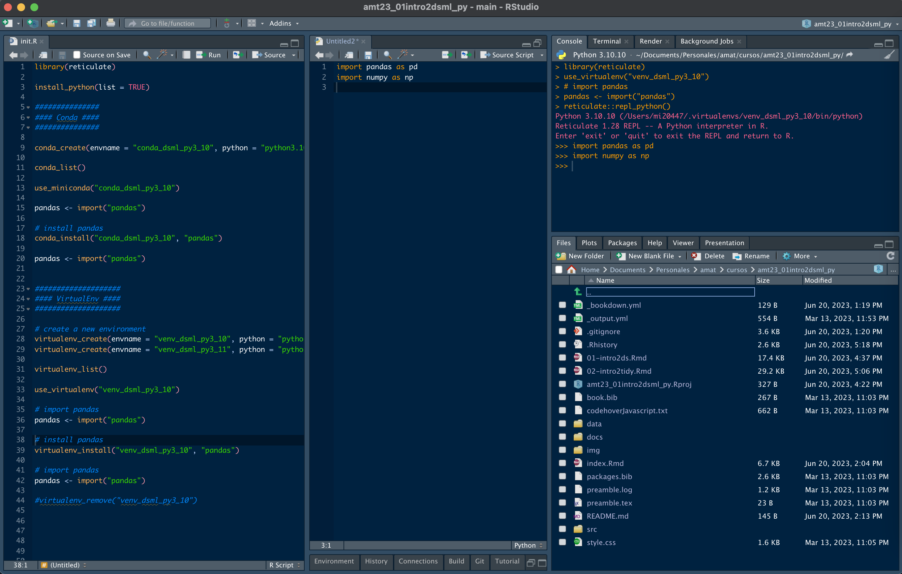

::: watermark

:::

# Introducción a Python

Python es un lenguaje de programación de alto nivel, interpretado y generalmente considerado como un lenguaje fácil de aprender y utilizar. Fue creado por *Guido van Rossum* y lanzado por primera vez en 1991. Python se destaca por su sintaxis clara y legible, lo que facilita la escritura y comprensión del código.

```{r, echo = F, fig.align = "center"}
knitr::include_graphics("img/02-intro2py/01_ds_python.jpeg")
```

Python se ha vuelto extremadamente popular en el campo de la ciencia de datos por varias razones:

1. **Facilidad de uso:** Python se destaca por su sintaxis simple y legible, lo que facilita a los científicos de datos escribir, leer y mantener el código. Además, cuenta con una gran cantidad de bibliotecas y paquetes que facilitan tareas comunes en el análisis de datos.

2. **Amplia comunidad y ecosistema:** Cuenta con una gran comunidad de desarrolladores y científicos de datos que contribuyen con bibliotecas y paquetes de código abierto para realizar diversas tareas en ciencia de datos. Algunas de las bibliotecas más populares incluyen NumPy (para cálculos numéricos), pandas (para procesamiento de dataframes), matplotlib (para gráficos), scikit-learn (para machine learning) y TensorFlow (para deep learning).

3. **Integración con otras tecnologías:** Python se puede integrar fácilmente con otras tecnologías y lenguajes, lo que lo convierte en una opción versátil para la ciencia de datos. Por ejemplo, es común utilizar Python junto con bases de datos, herramientas de big data como Apache Spark, y lenguajes como R y SQL.

4. **Flexibilidad:** Python es un lenguaje flexible que se adapta a diferentes necesidades en ciencia de datos. Puede utilizarse tanto para realizar tareas simples como el procesamiento y limpieza de datos, como para desarrollar modelos de aprendizaje automático complejos y aplicaciones de inteligencia artificial.

5. **Accesibilidad:** Python es un lenguaje de programación *open-source*, lo que significa que es de uso gratuito y todos pueden contribuir a su desarrollo. Esto permite que toda la comunidad tiene acceso a los desarrollos y contribuciones de código publicado. En el ámbito empresarial y académico disminuye los costos de software.

Estas características hacen de Python una herramienta poderosa y popular para realizar análisis de datos, desarrollar modelos de aprendizaje automático y abordar una amplia gama de problemas en la ciencia de datos.

## ¿Cómo obtener *Python*?

Python puede ser fácilmente descargado de forma gratuita desde el sitio oficial <https://www.python.org/downloads/>. Python está disponible para las plataformas Windows, Mac y Linux.

## ¿Qué es RStudio?

*RStudio* es un Entorno de Desarrollo Integrado (IDE, por sus siglas en inglés) creado por Posit (antes Rstudio) para R y Python. Este permite y facilita el desarrollo y ejecución de sintaxis para código en *R* y *python*, incluye una consola y proporciona herramientas para la gestión del espacio de trabajo. *RStudio* está disponible para Windows, Mac y Linux o para navegadores conectados a *RStudio Server o RStudio Server Pro*.

Algunas de las principales características de Rstudio que lo hacen una gran herramienta para trabajar, son:

-   Auto completado de código
-   Sangría inteligente
-   Resaltado de sintaxis
-   Facilidad para definir funciones
-   Soporte integrado
-   Documentación integrada
-   Administración de directorios y proyectos
-   Visor de datos
-   Depurador interactivo para corregir errores
-   Conección con Rmarkwon y Sweave

La siguiente imagen muestra la forma en la que está estructurado RStudio. El orden de los páneles puede ser elegido por el usuario, así como las características de tipo de letra, tamaño y color de fondo, entre otras características.

```{r, echo = F, fig.align = "center", fig.cap= "Páneles de trabajo de Rstudio"}

```

## Uso de python en Rstudio


```{python, eval = F}
library(reticulate)

install_python(list = TRUE)

use_python("C:/Program Files/Python310/python.exe")

#### Conda ####
# Creación de ambiente virtual de python 3.10 con conda
conda_create(envname = "conda_dsml_py3_10")

# Consultar la lista de ambientes creados
conda_list()

use_miniconda("conda_dsml_py3_10")

# instalar pandas
conda_install("conda_dsml_py3_10", "pandas")

pandas <- import("pandas")

#### VirtualEnv ####
# Creación de ambiente virtual de python 3.10 con virtualenv 
virtualenv_create(envname = "venv_dsml_py3_10")

virtualenv_list()

use_virtualenv("venv_dsml_py3_10")

# install pandas
virtualenv_install("venv_dsml_py3_10", "pandas")
```


## Lectura de datos

El primer paso para analizar datos es incorporarlos a la sesión de python para que puedan ser manipulados y observados. Existen múltiples librerías y funciones que permiten leer la información proveniente de un archivo externo, el cual puede tener una de muchas posibles extensiones.

Usualmente, no creamos los datos desde la sesión, sino que a través de un archivo externo se realiza la lectura de datos escritos en un archivo. Los más comúnes son:

```{r, echo=F, fig.align='center',fig.width=4 }
knitr::include_graphics("img/02-intro2py/03_archivos.jpg")
```

La paquetería *pandas* fue desarrollada recientemente para lidiar con la lectura de archivos rápidamente. Esta paquetería proporciona funciones que suelen ser mucho más rápidas que las funciones base que proporciona *python*.

### Archivos *csv*

A la hora de importar conjuntos de datos en *python*, uno de los formatos más habituales en los que hallamos información es en archivos separados por comas (comma separated values), cuya extensión suele ser *.csv*. En ellos encontramos múltiples líneas que recogen la tabla de interés, y en las cuales los valores aparecen, de manera consecutiva, separados por el carácter *,*.

Para importar este tipo de archivos en nuestra sesión de *python*, se utiliza la función `read_csv()`. 

El único argumento que debemos de pasar a esta función de manera obligatoria, es `file`, el nombre o la ruta completa del archivo que pretendemos importar.

La paquetería *pandas* fue desarrollada para lidiar con la lectura de archivos grandes rápidamente. 

Veamos un ejemplo:

```{r, echo=FALSE}
library(reticulate)

use_virtualenv("venv_dsml_py3_10")
```


```{python}
import pandas as pd

data_csv = pd.read_csv("data/ames.csv")

data_csv.info()

pd.set_option('display.max_columns', 6)
data_csv.head(5)

data_csv.describe()
```

La base de datos llamada [AmesHousing](https://1drv.ms/t/s!AuOiA083gYHmhKkcN26pn1mXQvqNAg?e=o5nhG7) contiene un conjunto de datos con información de la Oficina del Tasador de Ames utilizada para calcular los valores tasados para las propiedades residenciales individuales vendidas en Ames, Iowa, de 2006 a 2010. FUENTES: Ames, Oficina del Tasador de Iowa.

Pueden descargar los datos para la clase [aquí](https://1drv.ms/f/s!AuOiA083gYHmhKkZSv6N1bux0cYoAg)

¿Y si el archivo que necesitamos leer está en excel?

### Archivos txt

Uno de los archivos más comunes es el *.txt*. La librería *pandas* también cuenta con parámetros en la función *read_csv* que permiten leer fácilmente los datos contenidos en formato tabular.

```{python}
ames_txt = pd.read_csv("data/ames.txt", delimiter = ";")
ames_txt.head(3)
```

La función *read_csv()* funciona para leer archivos con diferentes delimitadores posibles, es decir, es posible especificar si las columnas están separadas por espacios, comas, punto y coma, tabulador o algún otro delimitador ("",",",";","\t", "\@").

Adicionalmente, se puede especificar si el archivo contiene encabezado, si existen renglones a saltar, codificación, tipo de variable y muchas más opciones. Todos estos detalles pueden consultarse en la documentación oficial.

### Archivos *xls* y *xlsx*

La paquetería *pandas* facilita la obtención de datos tabulares de archivos de *Excel*. Admite tanto el formato *.xls* heredado como el formato *.xlsx* moderno basado en *XML*. Es importante mencionar que es necesario instalar una dependencia para que funcione. Se requiere de la librería *openpyxl*

```{python}
ames_xlsx = pd.read_excel("data/ames.xlsx")
ames_xlsx.head(3)
```


### Archivos pickle

Un tipo de archivo que resulta de particular interés, es el *.pkl*. Este archivo comprime cualquier objeto o resultado que sea usado o producido en *python*. Uno puede almacenar el objeto de interés de la siguiente manera:

```{python}

ames_xlsx.to_pickle('data/ames.pkl')

```

Puede observarse que en el explorador de archivos se encuentra ahora el nuevo archivo con extensión *.pkl*, el cual puede ser posteriormente incorporado a una sesión de *python* para seguir trabajando con él.

```{python}
ames_pkl = pd.read_pickle('data/ames.pkl')

ames_pkl.head(3)
```

Algunas de las grandes ventajas que tiene almacenar los archivos en formato pickle, son las siguientes:

-   No es necesario volver a ejecutar procesos largos cuando ya se ha logrado realizar una vez.

-   El tiempo de lectura de la información es considerablemente más rápido.


## Consultas de datos

Python hoy en día es el lenguaje de programación más popular, sin embargo otros lenguajes aún mantienen ventajas al haber desarrollado librerías muy especializadas y limpias para trabajar. Esto no significa que todo esté perdido para python, pues algunos desarrolladores están tratando de emular las funciones que existen en otros lenguajes y que han sido ampliamente adoptados por la comunidad. 

En *R*, existe un conjunto de librerías llamado **TIDYVERSE** que sirve extraordinariamente para transformar y manipular datos. Aunque en python también se puede hacer con *pandas*, encontramos muy atractivo aprender funciones que se usan de igual manera en varios lenguajes de programación. La librería en python que simula a dplyr de tidyverse se conoce como **siuba**

El paquete *siuba* proporciona un conjunto de funciones muy útiles para manipular dataframes y así reducir el número de repeticiones, la probabilidad de cometer errores y el número de caracteres que hay que escribir. Como valor extra, podemos encontrar que la gramática de *siuba* es más fácil de entender.

Revisaremos algunas de sus funciones **más usadas** (*verbos*), así como el uso de **pipes** (>>) para combinarlas.

-   select()

-   filter()

-   arrange()

-   mutate()

-   summarise()

-   join()

-   group_by()


Primero tenemos que instalar y cargar la paquetería:
 
```{r, message=FALSE, warning=FALSE, eval = F}
#R
virtualenv_install("venv_dsml_py3_10", "siuba")
```

```{python}
# python
from siuba import *
```

Usaremos el dataset *AmesHousing* que se proporcionó en el capítulo anterior (el alumno puede hacer el ejercicio con datos propios, si así lo desea)

```{python, warning=FALSE, message=FALSE}
ames_housing = pd.read_csv("data/ames.csv")

ames_housing.info()

ames_housing.describe()
```

### Seleccionar columnas

Observamos que nuestros datos tienen 2,930 observaciones y 74 variables, con *select()* podemos seleccionar las variables que se indiquen.

```{python}
(
ames_housing >>
  select(_.Lot_Area, _.Neighborhood, _.Year_Sold, _.Sale_Price)
)
```

::: {.infobox .tip data-latex="{tip}"}
**¡¡ RECORDAR !!**
 
* El operador pipe (>>) se usa para conectar un elemento con una función o acción a realizar. En este caso solo se indica que en los datos de ames se seleccionan 4 variables.

* Al operador '_.' se le conoce como *siu-expresion*. Es muy útil para hacer referencia a una columna que se encuentra dentro del conjunto de datos que se encuentra operando.

* Para que el operador >> ejecute todo el pipeline es importante envolverlo entre paréntesis.
:::
 
 Con *select()* y *contains()* podemos seleccionar variables con alguna cadena de texto.

```{python}
(
 ames_housing >> 
  select(_.contains("Area"))
 )
```

De igual manera, con *select()*, *contains()* podemos seleccionar que inicien o terminen con alguna cadena de texto.

```{python}
(
 ames_housing >> 
 select(_.contains("^Garage"))
)
```

```{python}
(
 ames_housing >> 
 select(_.contains("Area$"))
)
```


### Filtrar observaciones

La función *filter()* nos permite filtrar filas según una condición, primero notemos que la variable *Sale_Condition* tiene distintas categorías.

```{python}
ames_housing['Sale_Condition'].value_counts()
```

::: {.infobox .important data-latex="{important}"}
**¡¡ SPOILER !!**
 
 En un modelo predictivo de Machine Learning, **no es correcto** agregar columnas cuyo valor es conocido hasta el momento de la observación. Es decir, no deben agregarse variables que no se conozca su valor al momento de la predicción, como es el caso de *condición de venta*.
:::
 
 Ahora usaremos la función *filter* para quedarnos solo con las observaciones con condición de venta "normal".

```{python}
(
  ames_housing >> 
  filter(_.Sale_Condition == "Normal")
)
```

También se puede usar para filtrar variables numéricas:
 
```{python}
(
  ames_housing >> 
  filter( (_.Lot_Area > 1000) & (_.Sale_Price >= 150000) )
)
```

Notemos que en el ejemplo anterior se usa *&*, que ayuda a filtrar por dos condiciones.

También puede usarse *\|* para filtrar por alguna de las dos condiciones.

```{python}
(
  ames_housing >> 
  filter((_.Lot_Area < 1000) | (_.Sale_Price <= 150000))
)
```

Las condiciones pueden ser expresiones lógicas construidas mediante los operadores relacionales y lógicos:
 
 -   **\<** : Menor que

-   **\>** : Mayor que

-   **==** : Igual que

-   **\<=** : Menor o igual que

-   **\>=** : Mayor o igual que

-   **!=** : Diferente que

-   **isin** : Pertenece al conjunto

-   **isnull** : Es NA

**EJERCICIO:**
 
 -   Practicar la función de filtro de observaciones usando los operadores auxiliares.

-   Concatenar el resultado de seleccionar columnas y posteriormente filtrar columnas.


### Ordenar registros

La función *arrange()* se utiliza para ordenar las filas de un data frame de acuerdo a una o varias variables. Este ordenamiento puede ser ascendente o descendente.

Por defecto *arrange()* ordena las filas por orden ascendente:
 
```{python}
(
  ames_housing 
  >> arrange(_.Sale_Price)
)
```

<br> <br>
 
 Si las queremos ordenar de forma ascendente, lo haremos del siguiente modo:
 
```{python}
(
  ames_housing >> 
  arrange(-_.Sale_Price)
)
```

Si se desea usar dos o más columnas para realizar el ordenamiento, deben separarse por comas cada una de las características

```{python}
(
ames_housing >> 
 arrange(_.Sale_Condition, -_.Sale_Price, _.Lot_Area) >>
 select(_.Sale_Condition, _.Sale_Price, _.Lot_Area)
)
```

Notemos que en el ejemplo anterior usamos dos *pipes* (\>\>), como habíamos mencionado se pueden usar los necesarios para combinar funciones.

### Agregar / Modificar

Con la función *mutate()* podemos computar transformaciones de variables en un data frame. A menudo, tendremos la necesidad de crear nuevas variables que se calculan a partir de variables existentes. La función *mutate()* proporciona una interfaz clara para realizar este tipo de operaciones.

Por ejemplo, haremos el cálculo de la antigüedad del inmueble a partir de las variables *Year_Sold* y *Year_Remod_Add*:
 
```{python}
ejemplo_mutate = (
 ames_housing >> 
   select(_.Year_Sold, _.Year_Remod_Add) >>
   mutate(Antique = _.Year_Sold - _.Year_Remod_Add)
)

ejemplo_mutate
```

El ejemplo anterior crea una nueva variable. Ahora se presenta otro ejemplo en donde se modifica una variable ya creada.

```{python}
(
ejemplo_mutate >> 
 mutate(Antique = _.Antique * 12)
)
```

En este segundo ejemplo, se modifica el número de años de antigüedad y se multiplica por un factor de 12 para modificar el tiempo en una escala de meses.


### Resumen estadístico

La función *summarize()* se comporta de forma análoga a la función *mutate()*, excepto que en lugar de añadir nuevas columnas crea un nuevo data frame que resumen el valor de los renglones a través de un estadístico.

Podemos usar el ejemplo anterior y calcular la media de la variable creada *Antique*:
 
```{python}
(
ames_housing >> 
 select(_.Year_Sold, _.Year_Remod_Add) >>
 mutate(Antique = _.Year_Sold - _.Year_Remod_Add) >>
 summarize(
  Mean_Antique = _.Antique.mean(),
  Median_Antique = _.Antique.median(),
  First_Antique = _.Antique.iloc[0],
  Last_Antique = _.Antique.iloc[-1],
  )
)
```

Solo fue necesario agregar un *pipe*, especificar el nombre de la variable creada y la operación a realizar.

A continuación se muestran funciones que trabajando conjuntamente con la función summarize() facilitarán nuestro trabajo diario. Todas ellas toman como argumento un vector y devuelven un único resultado:
 
 -   *min(), max()* : Valores max y min.

-   *mean()* : Media.

-   *median()* : Mediana.

-   *sum()* : Suma de los valores.

-   *var(), std()* : Varianza y desviación estándar.

-   *count()* : El número de valores en un vector.

-   *iloc()* : Especificar el índice del elemento a extraer


Mas adelante veremos como combinar esta función con la función *group_by()* para calcular estadísticos agrupados por alguna característica de interés.

**EJERCICIO:**
 
 * Realizar una consulta usando *summarize()* y cada una de las funciones estadísticas listadas anteriormente.


### Agrupamiento

La función *group_by()* agrupa un conjunto de filas de acuerdo con los valores de una o más columnas o expresiones.

Usaremos el ejemplo anterior. Primero creamos nuestra nueva variable *Antique*, después agrupamos por vecindario y al final calculamos la media de la variable *Antique*. Gracias al agrupamiento, nos regresara una media por cada grupo creado, es decir, nos regresara el promedio de la antigüedad por vecindario.

```{python,warning=FALSE,message=FALSE}
(
ames_housing >> 
 mutate(Antique = _.Year_Sold - _.Year_Remod_Add) >> 
 group_by(_.Neighborhood) >> 
 summarize(Mean_Antique = _.Antique.mean().round(0) )
)
```

::: {.infobox .tip data-latex="{tip}"}
**¡¡ REVISAR !!**
 
 En este [link](https://plydata.readthedocs.io/en/stable/api.html) se encuentra un buen resumen de las funciones complementarias a dplyr y tidyr de *R*. La librería se llama *plydata*.
:::

## Orden y estructura
 
```{=tex}
\begin{center}
"Las familias felices son todas iguales, cada familia infeliz es infeliz  a su propio modo."
\end{center}
```
```{=tex}
\begin{flushright}
\text{- Leo Tolstoy}
\end{flushright}
```

Un conjunto de datos puede ser representado de muchas maneras distintas y contener en todos los casos la misma información. Sin embargo, no todos los modos en que se presenta la información resulta óptimo para su procesamiento y análisis. Los conjuntos de datos ordenados serán más fáciles de trabajar y analizar.

Algunas de las características principales que presentan los conjuntos de datos ordenados son las siguientes:
 
 1.  Cada variable debe tener su propia columna.

2.  Cada observación debe tener su propio renglón.

3.  Cada valor debe tener su propia celda.

```{r echo=FALSE,fig.align='center', out.width='700pt'}
knitr::include_graphics("img/02-intro2py/04_tidy-1.png")
```

La figura anterior muestra la estructura de orden que debe tener un conjunto de datos. A pesar de que pueda parecer intuitivo y sencillo, en la práctica es considerable el número de conjuntos de datos desordenados. La limpieza y ordenamiento debe ser trabajado de forma impecable a fin de que puedan realizarse buenas prácticas. El tiempo de limpieza y ordenamiento varía mucho dependiendo de la dimensión del conjunto de datos.

Algunos de los principales problemas que pueden tener los conjuntos de datos no ordenados son:
 
-   Una variable puede estar dispersa en múltiples columnas

-   Una observación puede estar esparcida en múltiples renglones

La paquetería **plydata** cuenta con funciones para resolver dichos problemas. Entre las principales funciones que tiene la paquetería, se encuentran *pivot_longer()*, *pivot_wider()*, mismas que se analizarán a continuación.

Primero tenemos que instalar y cargar la paquetería:
 
```{r, message=FALSE, warning=FALSE, eval = F}
#R
virtualenv_install("venv_dsml_py3_10", "plydata")
```

```{python}
# python
import plydata as pr

(
  ames_housing >>
  mutate(Antique = _.Year_Sold - _.Year_Remod_Add) >>
  mutate(Antique_status = if_else(_.Antique < 10, "new", "old") ) >>
  pr.group_by("Antique_status") >>
  pr.tally()
)
```


### Pivote horizontal

La función *pivot_wider()* resulta muy útil a la hora de organizar los datos. Su función consiste en **dispersar una variable clave en múltiples columnas**.

Lo primero que se debe hacer para poder hacer uso de dicha función es instalar y cargar la librería.

El siguiente conjunto de datos contiene el número de localidades rurales y urbanas por municipio de la Ciudad de México. Como es posible observar, algunos municipios aparecen más de una vez en el marco de datos, esto se debe a que cada municipio puede tener ambos ámbitos, rural y urbano. Para hacer que el conjunto de datos sea ordenado, es necesario que cada observación aparezca una sola vez por renglón y cada una de las categorías (rural y urbano) de la variable "Ámbito" deberá ocupar el lugar de una columna.

El siguiente código muestra cómo convertir los datos no ordenados en un conjunto ordenado.

```{r, eval=FALSE, echo=FALSE}
library(tidyr)

Resumen <- readRDS("data/loc_mun_cdmx.rds")
py_save_object(Resumen, "data/loc_mun_cdmx.pkl", pickle = "pickle")

us_rent_income
py_save_object(us_rent_income, "data/us_rent_income.pkl", pickle = "pickle")

relig_income
py_save_object(relig_income, "data/relig_income.pkl", pickle = "pickle")
```

```{python}
import pickle

with open('data/loc_mun_cdmx.pkl', 'rb') as f:
    loc_mun_cdmx = pickle.load(f)

loc_mun_cdmx
```

En la tabla actual existe ahora un y solo un registro por cada observación (nombre de municipio en este caso). El valor que le corresponde a cada una de las columnas creadas es la frecuencia absoluta de localidades que tienen la característica "Rural" y "Urbano" respectivamente.

Pero... ¿qué pasa cuando no existen todos los valores en ambas columnas? Si no se especifica la manera de llenar los datos faltantes, estos contendrán NAs. Siempre se puede elegir el caracter o número con el cual se imputan los datos faltantes.

```{python}
from plydata.tidy import pivot_wider

(
loc_mun_cdmx >>
    pivot_wider(names_from = "Ambito", values_from = "Total_localidades")
)
```

```{python}
(
loc_mun_cdmx >>
    pivot_wider(
     names_from = "Ambito", 
     values_from = "Total_localidades", 
     values_fill = 0
    )
)

```


En caso de que existan múltiples columnas que se desean dispersar mediante el pivote de una columna con múltiples categorías, es posible especificar tal re estructuración a través del siguiente código.

```{python}
with open('data/us_rent_income.pkl', 'rb') as f:
    us_rent_income = pickle.load(f)

us_rent_income

(
us_rent_income >>
    select(-_.GEOID) >>
    pivot_wider(
     names_from = "variable", 
     values_from = ["estimate", "moe"]
    )
)
```

**Ejercicio:**
 
 1) Agrupa los datos de localidades por ámbito

2) Agrega una columna con el porcentaje de localidades por alcaldía

3) Realiza un pivote horizontal sobre el ámbito y las variables numéricas de total de localidades y su respectivo porcentaje de población (crear).

4) Ordena los registros de forma descendente de acuerdo con el total de localidades rural y urbano.


### Pivote vertical

*pivot_longer()* es podría ser la función inversa de la anterior, se necesita comúnmente para ordenar los conjuntos de datos capturados en crudo, ya que a menudo no son capturados acorde a las mejores estructuras para facilitar el análisis.

El conjunto de datos *relig_income* almacena recuentos basados en una encuesta que (entre otras cosas) preguntó a las personas sobre su religión e ingresos anuales:
 
 
```{python}
with open('data/relig_income.pkl', 'rb') as f:
    relig_income = pickle.load(f)

relig_income
```


¿Crees que ésta es la mejor estructura para la tabla? ¿Cómo imaginas que podría modificarse?
 
Este conjunto de datos contiene tres variables:
 
1)  religión, almacenada en las filas

2)  income repartidos entre los nombres de columna

3)  count almacenado en los valores de las celdas.

Para ordenarlo usamos *pivot_longer()*:
 
```{python}
from plydata.tidy import pivot_longer

(
 relig_income >>
 pivot_longer(
  cols = ['<$10k', '$10-20k', '$20-30k', '$30-40k', '$40-50k', '$50-75k',
          '$75-100k', '$100-150k', '>150k', "Don't know/refused"], 
  names_to = "income", 
  values_to = "count")
)
```
 

-   El primer argumento es el conjunto de datos para remodelar, relig_income.

-   El segundo argumento describe qué columnas necesitan ser reformadas. En este caso, son todas las columnas excepto por religion.

-   El **names_to** da el nombre de la variable que se creará a partir de los datos almacenados en los nombres de columna, es decir, ingresos.

-   Los **values_to** dan el nombre de la variable que se creará a partir de los datos almacenados en el valor de la celda, es decir, count. Ni la columna names_to ni la values_to existen en relig_income, por lo que las proporcionamos como cadenas de caracteres entre comillas.


<div class="watermark"></div>