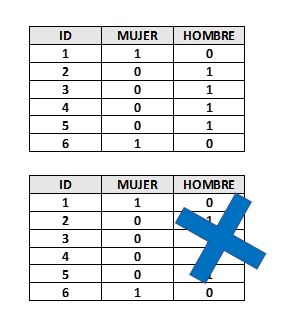
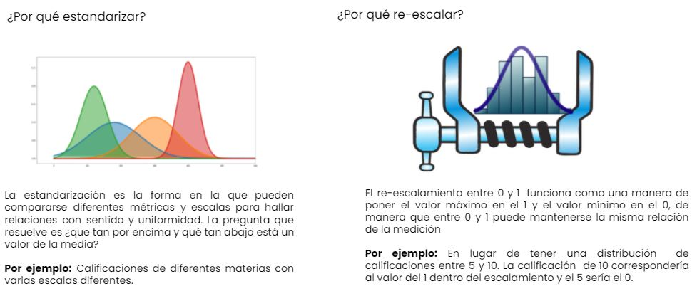

::: watermark

:::

# Introducción a Machine Learning

Como se había mencionado, el Machine Learning es una disciplina del campo de la
Inteligencia Artificial que, a través de algoritmos, dota a los ordenadores de
la capacidad de identificar patrones en datos para hacer predicciones. Este
aprendizaje permite a los computadores realizar tareas específicas de forma
autónoma.

El término se utilizó por primera vez en 1959. Sin embargo, ha ganado relevancia
en los últimos años debido al aumento de la capacidad de computación y al *BOOM*
de los datos.

Un algoritmo para computadoras puede ser pensado como una receta. Describe
exactamente qué pasos se realizan uno tras otro. Los ordenadores no entienden
las recetas de cocina, sino los lenguajes de programación: En ellos, el
algoritmo se descompone en pasos formales (comandos) que el ordenador puede
entender.

```{r, fig.align='center', out.width = "400pt", eval = T, echo=FALSE}
knitr::include_graphics("img/04-ml/01_WebQuest.gif")
```

La cuestión no es solo saber para qué sirve el Machine Learning, sino que saber
cómo funciona y cómo poder implementarlo en la industria para aprovecharse de
sus beneficios. Hay ciertos pasos que usualmente se siguen para crear un modelo
de Machine Learning. Estos son típicamente realizados por científicos de los
datos que trabajan en estrecha colaboración con los profesionales de los
negocios para los que se está desarrollando el modelo.

-   **Seleccionar y preparar un conjunto de datos de entrenamiento**

Los **datos de entrenamiento** son un conjunto de datos representativos de los
datos que el modelo de Machine Learning ingerirá para resolver el problema que
está diseñado para resolver.

Los datos de entrenamiento deben prepararse adecuadamente: aleatorizados y
comprobados en busca de desequilibrios o sesgos que puedan afectar al
entrenamiento. También deben dividirse en dos subconjuntos: el **subconjunto de
entrenamiento**, que se utilizará para entrenar el algoritmo, y el **subconjunto
de validación**, que se utilizará para probarlo y perfeccionarlo.

```{r, echo=FALSE, out.width = "600pt", fig.align='center'}
knitr::include_graphics("img/04-ml/02_train-and-test.png")
```

-   **Elegir un algoritmo para ejecutarlo en el conjunto de datos de
    entrenamiento**

Este es uno de los pasos más importantes, ya que se debe elegir qué algoritmo
utilizar, siendo este un conjunto de pasos de procesamiento estadístico. El tipo
de algoritmo depende del tipo (supervisado o no supervisado), la cantidad de
datos del conjunto de datos de entrenamiento y del tipo de problema que se debe
resolver.

```{r, echo=FALSE, out.width = "600pt", fig.align='center'}
#knitr::include_graphics("img/04-ml/modelos.jpg")
```

```{r, eval = TRUE, echo=FALSE, out.width = "600pt", fig.align='center'}

```

-   **Entrenamiento del algoritmo para crear el modelo**

El entrenamiento del algoritmo es un proceso iterativo: implica ejecutar las
variables a través del algoritmo, comparar el resultado con los resultados que
debería haber producido, ajustar los pesos y los sesgos dentro del algoritmo que
podrían dar un resultado más exacto, y ejecutar las variables de nuevo hasta que
el algoritmo devuelva el resultado correcto la mayoría de las veces. El
algoritmo resultante, entrenado y preciso, es el modelo de Machine Learning.

```{r, echo=FALSE, out.width = "600pt", fig.align='center'}
knitr::include_graphics("img/04-ml/04_entrenamiento.png")
```

-   **Usar y mejorar el modelo**

El paso final es utilizar el modelo con nuevos datos y, en el mejor de los
casos, para que mejore en precisión y eficacia con el tiempo. De dónde procedan
los nuevos datos dependerá del problema que se resuelva. Por ejemplo, un modelo
de Machine Learning diseñado para identificar el spam ingerirá mensajes de
correo electrónico, mientras que un modelo de Machine Learning que maneja una
aspiradora robot ingerirá datos que resulten de la interacción en el mundo real
con muebles movidos o nuevos objetos en la habitación.

```{r, echo=FALSE, out.width = "600pt", fig.align='center'}
knitr::include_graphics("img/04-ml/05_competencia.webp")
```

## Análisis Supervisado vs No supervisado

Los algoritmos de Machine Learning se dividen en tres categorías, siendo las dos
primeras las más comunes:

```{r, fig.align='center', echo=F, out.height='500pt', out.width='750pt'}
knitr::include_graphics("img/04-ml/06_ml2.png")
```

-   **Aprendizaje supervisado**: estos algoritmos cuentan con un aprendizaje
    previo basado en un sistema de etiquetas asociadas a unos datos que les
    permiten tomar decisiones o hacer predicciones.

Algunos ejemplos son:

    - Un detector de spam que etiqueta un e-mail como spam o no.

    - Predecir precios de casas

    - Clasificación de imagenes

    - Predecir el clima

    - ¿Quiénes son los clientes descontentos?

-   **Aprendizaje no supervisado:** en el aprendizaje supervisado, la idea
    principal es aprender bajo supervisión, donde la señal de supervisión se
    nombra como valor objetivo o etiqueta. En el aprendizaje no supervisado,
    carecemos de este tipo de etiqueta. Por lo tanto, necesitamos encontrar
    nuestro camino sin ninguna supervisión ni guía. Esto simplemente significa
    que necesitamos descubrir qué es qué por nosotros mismos.

Algunos ejemplos son:

    - Encontrar segmentos de clientes.

    - Reducir la complejidad de un problema

    - Selección de variables

    - Encontrar grupos

    - Reducción de dimensionalidad

-   **Aprendizaje por refuerzo:** su objetivo es que un algoritmo aprenda a
    partir de la propia experiencia. Esto es, que sea capaz de tomar la mejor
    decisión ante diferentes situaciones de acuerdo a un proceso de prueba y
    error en el que se recompensan las decisiones correctas.

Algunos ejemplos son:

    - Reconocimiento facial

    - Diagnósticos médicos

    - Clasificar secuencias de ADN

### Regresión vs clasificación

Existen dos tipos principales de aprendizaje supervisado, esto depende del tipo
de la variable respuesta:

#### Clasificación {.unnumbered}

En el aprendizaje supervisado, los algoritmos de clasificación se usan cuando el
resultado es una etiqueta discreta. Esto quiere decir que se utilizan cuando la
respuesta se fundamenta en conjunto finito de resultados.

#### Regresión {.unnumbered}

El análisis de regresión es un subcampo del aprendizaje automático supervisado
cuyo objetivo es establecer un método para la relación entre un cierto número de
características y una variable objetivo continua.

<br/>

```{r echo=FALSE,fig.align='center', out.height='450pt', out.width='700pt'}
knitr::include_graphics("img/04-ml/07_regresion_clasificacion.png")
```

## Sesgo vs varianza

En el mundo de Machine Learning cuando desarrollamos un modelo nos esforzamos
para hacer que sea lo más preciso, ajustando los parámetros, pero la realidad es
que no se puede construir un modelo 100% preciso ya que nunca pueden estar
libres de errores.

Comprender cómo las diferentes fuentes de error generan sesgo y varianza nos
ayudará a mejorar el proceso de ajuste de datos, lo que resulta en modelos más
precisos, adicionalmente también evitará el error de sobre-ajuste y falta de
ajuste.


### Balance entre sesgo y varianza o Trade-off

El objetivo de cualquier algoritmo supervisado de Machine Learning es lograr un
sesgo bajo, una baja varianza y a su vez el algoritmo debe lograr un buen
rendimiento de predicción.

```{r echo=FALSE,fig.align='center', out.height='450pt', out.width='650pt'}
knitr::include_graphics("img/04-ml/08_tradeoff.jpeg")
```

El sesgo frente a la varianza se refiere a la precisión frente a la consistencia
de los modelos entrenados por su algoritmo. Podemos diagnosticarlos de la
siguiente manera:

```{r echo=FALSE,fig.align='center', out.height='350pt', out.width='650pt'}
knitr::include_graphics("img/04-ml/09_altobias.jpeg")
```

Los algoritmos de baja varianza (alto sesgo) tienden a ser menos complejos, con
una estructura subyacente simple o rígida.

```{r echo=FALSE,fig.align='center', out.height='350pt', out.width='650pt'}
knitr::include_graphics("img/04-ml/10_bajobias.jpeg")
```

Los algoritmos de bajo sesgo (alta varianza) tienden a ser más complejos, con
una estructura subyacente flexible.

No hay escapatoria a la relación entre el sesgo y la varianza en Machine
Learning, aumentar el sesgo disminuirá la varianza, aumentar la varianza
disminuirá el sesgo.

### Error total

Comprender el sesgo y la varianza es fundamental para comprender el
comportamiento de los modelos de predicción, pero en general lo que realmente
importa es el error general, no la descomposición específica. El punto ideal
para cualquier modelo es el nivel de complejidad en el que el aumento en el
sesgo es equivalente a la reducción en la varianza.

Para construir un buen modelo, necesitamos encontrar un buen equilibrio entre el
sesgo y la varianza de manera que minimice el error total.

```{r echo=FALSE,fig.align='center', out.height='350pt', out.width='650pt'}
knitr::include_graphics("img/04-ml/11_biasvar.png")
```

### Overfitting

-   El modelo es muy particular.

-   Error debido a la varianza

-   Durante el entrenamiento tiene un desempeño muy bueno, pero al pasar nuevos
    datos su desempeño es malo.

### Underfitting

-   El modelo es demasiado general.

-   Error debido al sesgo.

-   Durante el entrenamiento no tiene un buen desempeño.

```{r, fig.align='center', echo=F, out.height='350pt', out.width='600pt'}
knitr::include_graphics("img/04-ml/12_over_under.jpg")
```

### Error irreducible

El error irreducible no se puede reducir, independientemente de qué algoritmo se
usa. También se le conoce como ruido y, por lo general, proviene por factores
como variables desconocidas que influyen en el mapeo de las variables de entrada
a la variable de salida, un conjunto de características incompleto o un problema
mal enmarcado. Acá es importante comprender que no importa cuán bueno hagamos
nuestro modelo, nuestros datos tendrán cierta cantidad de ruido o un error
irreductible que no se puede eliminar.


## Partición de datos

```{r, fig.align='center', out.height='300pt', out.width='600pt', echo=F, include=TRUE}
knitr::include_graphics("img/04-ml/01_train_vs_test.jpeg")
```

Cuando hay una gran cantidad de datos disponibles, una estrategia inteligente es
asignar subconjuntos específicos de datos para diferentes tareas, en lugar de
asignar la mayor cantidad posible solo a la estimación de los parámetros del
modelo.

Si el conjunto inicial de datos no es lo suficientemente grande, habrá cierta
superposición de cómo y cuándo se asignan nuestros datos, y es importante contar
con una metodología sólida para la partición de datos.

### Métodos comunes para particionar datos

El enfoque principal para la validación del modelo es dividir el conjunto de
datos existente en dos conjuntos distintos:

-   **Entrenamiento:** Este conjunto suele contener la mayoría de los datos, los
    cuales sirven para la construcción de modelos donde se pueden ajustar
    diferentes modelos, se investigan estrategias de ingeniería de
    características, etc.

    La mayor parte del proceso de modelado se utiliza este conjunto.

-   **Prueba:** La otra parte de las observaciones se coloca en este conjunto.
    Estos datos se mantienen en reserva hasta que se elijan uno o dos modelos
    como los de mejor rendimiento.

    El conjunto de prueba se utiliza como árbitro final para determinar la
    eficiencia del modelo, por lo que es fundamental mirar el conjunto de prueba
    una sola vez.

Supongamos que asignamos el $80\%$ de los datos al conjunto de entrenamiento y
el $20\%$ restante a las pruebas. El método más común es utilizar un muestreo
aleatorio simple. En python existe un módulo de *sklearn* que permite hacer tal separación de datos:

```{python}
import pandas as pd
from siuba import *
from sklearn.model_selection import train_test_split

ames = pd.read_csv("data/ames.csv")

y = ames >> select(_.Sale_Price)
X = select(ames, -_.Sale_Price)

X_train, X_test, y_train, y_test = train_test_split(
 X, y, 
 test_size = 0.20, 
 random_state = 12345
 )

print("Tamaño de conjunto de entrenamiento: ", X_train.shape)
print("Tamaño de conjunto de prueba: ", X_test.shape)
```

El muestreo aleatorio simple es apropiado en muchos casos, pero hay excepciones.

Cuando hay un desbalance de clases en los problemas de clasificación, el uso de una muestra aleatoria simple puede asignar al azar estas muestras poco frecuentes de manera desproporcionada al conjunto de entrenamiento o prueba.

Para evitar esto, se puede utilizar un muestreo estratificado. La división de entrenamiento/prueba se lleva a cabo por separado dentro de cada clase y luego estas submuestras se combinan en el conjunto general de entrenamiento y prueba.

Para los problemas de regresión, los datos de los resultados se pueden agrupar artificialmente en cuartiles y luego realizar un muestreo estratificado cuatro veces por separado. Este es un método eficaz para mantener similares las distribuciones del resultado entre el conjunto de entrenamiento y prueba.

```{r, fig.align='center', out.height='300pt', out.width='600pt', echo=F, include=TRUE}

```

Observamos que la distribución del precio de venta está sesgada a la derecha.
Las casas más caras no estarían bien representadas en el conjunto de
entrenamiento con una simple partición; esto aumentaría el riesgo de que nuestro
modelo sea ineficaz para predecir el precio de dichas propiedades.

Las líneas verticales punteadas indican los cuatro cuartiles para estos datos.
Una muestra aleatoria estratificada llevaría a cabo la división 80/20 dentro de
cada uno de estos subconjuntos de datos y luego combinaría los resultados. En
*sklearn*, esto se logra usando el argumento de estratos:

```{python}
import numpy as np

numeric_column = ames["Sale_Price"].to_numpy()
quartiles = np.percentile(numeric_column, [25, 50, 75])

# Crea una nueva variable categórica basada en los cuartiles
stratify_variable = pd.cut(
 numeric_column, 
 bins=[float('-inf'), quartiles[0], quartiles[1], quartiles[2], float('inf')],
 labels=["Q1", "Q2", "Q3", "Q4"]
 )

X_train, X_test, y_train, y_test = train_test_split(
 X, y, 
 test_size = 0.20, 
 random_state = 12345, 
 stratify = stratify_variable
 )
 
```

#### ¿Qué proporción debería ser usada? {.unnumbered}

No hay un porcentaje de división óptimo para el conjunto de entrenamiento y
prueba. Muy pocos datos en el conjunto de entrenamiento obstaculizan la
capacidad del modelo para encontrar estimaciones de parámetros adecuadas y muy
pocos datos en el conjunto de prueba reducen la calidad de las estimaciones de
rendimiento.

Se debe elegir un porcentaje que cumpla con los objetivos de nuestro proyecto
con consideraciones que incluyen:

-   Costo computacional en el entrenamiento del modelo.
-   Costo computacional en la evaluación del modelo.
-   Representatividad del conjunto de formación.
-   Representatividad del conjunto de pruebas.

Los porcentajes de división más comunes comunes son:

-   Entrenamiento: $80\%$, Prueba: $20\%$
-   Entrenamiento: $67\%$, Prueba: $33\%$
-   Entrenamiento: $50\%$, Prueba: $50\%$


### Conjunto de validación

El conjunto de validación se definió originalmente cuando los investigadores se
dieron cuenta de que medir el rendimiento del conjunto de entrenamiento conducía
a resultados que eran demasiado optimistas.

Esto llevó a modelos que se sobre-ajustaban, lo que significa que se
desempeñaron muy bien en el conjunto de entrenamiento pero mal en el conjunto de
prueba.

Para combatir este problema, se retuvo un pequeño conjunto de datos de
*validación* y se utilizó para medir el rendimiento del modelo mientras este
está siendo entrenado. Una vez que la tasa de error del conjunto de validación
comenzara a aumentar, la capacitación se detendría.

En otras palabras, el conjunto de validación es un medio para tener una idea
aproximada de qué tan bien se desempeñó el modelo antes del conjunto de prueba.

```{r, fig.align='center', out.height='250pt', out.width='500pt', echo=F, include=TRUE}
knitr::include_graphics("img/04-ml/3-5-3-conjunto-validacion.png")
```

Los conjuntos de validación se utilizan a menudo cuando el conjunto de datos
original es muy grande. En este caso, una sola partición grande puede ser
adecuada para caracterizar el rendimiento del modelo sin tener que realizar
múltiples iteraciones de remuestreo.

Con *sklearn*, un conjunto de validación es como cualquier otro objeto de
remuestreo; este tipo es diferente solo en que tiene una sola iteración

```{r, fig.align='center', out.height='350pt', out.width='500pt', echo=F, include=TRUE}
knitr::include_graphics("img/04-ml/3-5-3-conjunto-validacion-2.png")
```

```{python}

# Dividir los datos en entrenamiento (60%) y el resto (40%)
X_train, X_temp, y_train, y_temp = train_test_split(
 X, y, 
 test_size = 0.4, 
 random_state = 12345
 )

# Dividir el resto en conjuntos de prueba (15%) y validación (25%)
X_test, X_val, y_test, y_val = train_test_split(
 X_temp, y_temp, 
 test_size = 0.625, 
 random_state = 42
 )

# Training (60%), testing (15%), validation (25%)

# Imprimir los tamaños de los conjuntos resultantes
print("Tamaño de conjunto de entrenamiento: ", X_train.shape)
print("Tamaño de conjunto de prueba: ", X_test.shape)
print("Tamaño de conjunto de validación: ", X_val.shape)
```

Esta función regresa una columna para los objetos de división de datos y una
columna llamada id que tiene una cadena de caracteres con el identificador de
remuestreo.

El argumento de estratos hace que el muestreo aleatorio se lleve a cabo dentro
de la variable de estratificación. Esto puede ayudar a garantizar que el número
de datos en los datos del análisis sea equivalente a las proporciones del
conjunto de datos original. (Los estratos inferiores al 10% del total se
agrupan).

Otra opción de muestreo bastante común es la realizada mediante múltiples
submuestras de los datos originales.

```{r, fig.align='center', out.height='350pt', out.width='500pt', echo=F, include=TRUE}
knitr::include_graphics("img/04-ml/18_1_cross_validation.png")
```

Diversos métodos se revisarán a lo largo del curso.


### Leave-one-out cross-validation

La validación cruzada es una manera de predecir el ajuste de un modelo a un hipotético conjunto de datos de prueba cuando no disponemos del conjunto explícito de datos de prueba.

El método *LOOCV* en un método iterativo que se inicia empleando como conjunto de entrenamiento todas las observaciones disponibles excepto una, que se excluye para emplearla como validación.

Si se emplea una única observación para calcular el error, este varía mucho dependiendo de qué observación se haya seleccionado. Para evitarlo, el proceso se repite tantas veces como observaciones disponibles se tengan, excluyendo en cada iteración una observación distinta, ajustando el modelo con el resto y calculando el error con dicha observación.

Finalmente, el error estimado por el es el promedio de todos lo $i$ errores calculados.

La principal desventaja de este método es su costo computacional. El proceso requiere que el modelo sea reajustado y validado tantas veces como observaciones disponibles se tengan lo que en algunos casos puede ser muy complicado.

*sklearn* contiene la función `LeaveOneOut()`.

```{python, eval}
from sklearn.model_selection import LeaveOneOut, cross_val_score
from sklearn.linear_model import LinearRegression

y = ames >> select(_.Sale_Price)  ## Otra forma: ames["Sale_Price"]
X = select(ames, _.Gr_Liv_Area)

# Crea el regresor lineal que deseas evaluar
regressor = LinearRegression()

# Crea el objeto Leave-One-Out Cross-Validation
loo = LeaveOneOut()

# Realiza la validación cruzada LOOCV y obtén los scores de cada iteración
scores = cross_val_score(
 regressor, X, y, cv = loo, 
 scoring='neg_mean_squared_error',
 error_score = 'raise')

# Calcula el promedio y la desviación estándar de los scores
mean_score = -scores.mean()
std_score = scores.std()

# Imprime los resultados
print("Scores de cada iteración:", scores)
print("Promedio del score:", mean_score)
print("Desviación estándar del score:", std_score)

```


### K Fold Cross Validation

En la validación cruzada de K iteraciones (K Fold Cross Validation) los datos de
muestra se dividen en K subconjuntos. Uno de los subconjuntos se utiliza como
datos de prueba y el resto como datos de entrenamiento. El proceso de
validación cruzada es repetido durante $k$ iteraciones, con cada uno de los
posibles subconjuntos de datos de prueba.

Finalmente se obtiene el promedio de los rendimientos de cada iteración para
obtener un único resultado. Lo más común es utilizar la validación cruzada de 10
iteraciones.

```{r, fig.align='center', out.height='250pt', out.width='550pt', echo=F, include=TRUE}
knitr::include_graphics("img/04-ml/3-5-4-VFCV.jpg")
```

Este método de validación cruzada se utiliza principalmente para:

-   **Estimar el error** cuando nuestro conjunto de prueba es muy pequeño. Es decir,
    se tiene la misma configuración de parámetros y solamente cambia el conjunto
    de prueba y validación.

-   **Encontrar lo mejores hiperparámetros** que ajusten mejor el modelo. Es decir,
    en cada bloque se tiene una configuración de hiperparámetros distinto y se
    seleccionará aquellos hiperparámetros que hayan producido el error más
    pequeño.

```{r, fig.align='center', out.height='250pt', out.width='550pt', echo=F, include=TRUE}
knitr::include_graphics("img/04-ml/3-5-4-VFCV-tune.png")
```

En python, esto se logra mediante las siguiente función:

```{python}
from sklearn.model_selection import KFold

# Crea el objeto K-Fold Cross-Validation con K=5 (puedes cambiar el valor de K según tus necesidades)
kf = KFold(n_splits = 10, shuffle = True, random_state = 42)

# Realiza la validación cruzada KFCV y obtén los scores de cada iteración
scores = cross_val_score(
 regressor, X, y, cv = kf, 
 scoring='neg_mean_squared_error'
 )

# Calcula el promedio y la desviación estándar de los scores
mean_score = -scores.mean()
std_score = scores.std()

# Imprime los resultados
print("Scores de cada iteración:", scores)
print("Promedio del score:", mean_score)
print("Desviación estándar del score:", std_score)
```

Éste método nos permite detectar el nivel de error para diferentes conjuntos de entrenamiento y validación. El modelo es el mismo, pero existen pequeñas perturbaciones en los datos que ayudan a estimar el promedio y desviación estándar del nivel de precisión del modelo.


### Validación cruzada para series de tiempo

En este procedimiento, hay una serie de conjuntos de prueba, cada uno de los
cuales consta de una única observación. El conjunto de entrenamiento
correspondiente consta solo de observaciones que ocurrieron antes de la
observación que forma el conjunto de prueba. Por lo tanto, no se pueden utilizar
observaciones futuras para construir el pronóstico.

El siguiente diagrama ilustra la serie de conjuntos de entrenamiento y prueba,
donde las observaciones azules forman los conjuntos de entrenamiento y las
observaciones rojas forman los conjuntos de prueba.

```{r, fig.align='center', out.height='300pt', out.width='550pt', echo=F, include=TRUE}
knitr::include_graphics("img/04-ml/3-5-6-validacion-cruzada-series-tiempo.png")
```

La precisión del pronóstico se calcula promediando los conjuntos de prueba. Este
procedimiento a veces se conoce como "evaluación en un origen de pronóstico
continuo" porque el "origen" en el que se basa el pronóstico avanza en el
tiempo.

Con los pronósticos de series de tiempo, los pronósticos de un paso pueden no
ser tan relevantes como los pronósticos de varios pasos. En este caso, el
procedimiento de validación cruzada basado en un origen de pronóstico continuo
se puede modificar para permitir el uso de errores de varios pasos.

Suponga que estamos interesados en modelos que producen buenos pronósticos de 4
pasos por delante. Entonces el diagrama correspondiente se muestra a
continuación.

```{r, fig.align='center', out.height='300pt', out.width='550pt', echo=F, include=TRUE}
knitr::include_graphics("img/04-ml/3-5-6-validacion-cruzada-series-tiempo-2.png")
```

::: {.infobox .important data-latex="{important}"}
**¡¡ I M P O R T A N T E !!**

El modo de entrenar un modelo debe hacerse imitando la manera en que se realizarán las predicciones posteriormente. Es decir: 

Si se pretenden hacer predicciones de eventos futuros (dentro de un mes), al momento de entrenar el modelo los datos deben corresponder al estatus en que se encontraban 1 mes antes de observar la variable de respuesta y la variable de respuesta debe ser el valor real que se deseaba predecir.
:::


## Feature engineering

```{r, include=FALSE}
library(tidyverse)
library(tidymodels) 
library(recipes)
library(ggplot2)
library(kableExtra)
```

Hay varios pasos que se deben de seguir para crear un modelo útil:

-   Recopilación de datos.
-   Limpieza de datos.
-   Creación de nuevas variables.
-   Estimación de parámetros.
-   Selección y ajuste del modelo.
-   Evaluación del rendimiento.

Al comienzo de un proyecto, generalmente hay un conjunto finito de datos
disponibles para todas estas tareas.

**OJO:** A medida que los datos se reutilizan para múltiples tareas, aumentan
los riesgos de agregar sesgos o grandes efectos de errores metodológicos.


Como punto de partida para nuestro flujo de trabajo de aprendizaje automático,
necesitaremos datos de entrada. En la mayoría de los casos, estos datos se
cargarán y almacenarán en forma de *data frames*. Incluirán una
o varias variables predictivas y, en caso de aprendizaje supervisado, también
incluirán un resultado conocido.

Sin embargo, no todos los modelos pueden lidiar con diferentes problemas de
datos y, a menudo, necesitamos transformar los datos para obtener el mejor
rendimiento posible del modelo. Este proceso se denomina **pre-procesamiento** y
puede incluir una amplia gama de pasos, como:

-   **Dicotomización de variables:** Variables cualitativas que solo pueden
    tomar el valor $0$ o $1$ para indicar la ausencia o presencia de una
    condición específica. Estas variables se utilizan para clasificar los datos
    en categorías mutuamente excluyentes o para activar comandos de encendido /
    apagado

```{r, fig.align='center', out.height='200pt', out.width='400pt', echo=F, include=TRUE}

knitr::include_graphics("img/04-ml/hombre-mujer.jpg")

knitr::include_graphics("img/04-ml/sino.jpg")
```

-   **Near Zero Value (nzv) o Varianza Cero:** En algunas situaciones, el
    mecanismo de generación de datos puede crear predictores que solo tienen un
    valor único (es decir, un "predictor de varianza cercando a cero"). Para
    muchos modelos (excluidos los modelos basados en árboles), esto puede hacer
    que el modelo se bloquee o que el ajuste sea inestable.

De manera similar, los predictores pueden tener solo una pequeña cantidad de
valores únicos que ocurren con frecuencias muy bajas.

```{r, fig.align='center', out.width='500pt', echo=F, include=TRUE}

knitr::include_graphics("img/04-ml/hombres.jpg")

```

-   **Imputaciones:** Si faltan algunos predictores, ¿deberían estimarse
    mediante imputación?

```{r, fig.align='center', out.width='400pt', echo=F, include=TRUE}

knitr::include_graphics("img/04-ml/imputar.jpg")

```

-   **Des-correlacionar:** Si hay predictores correlacionados, ¿debería
    mitigarse esta correlación? Esto podría significar filtrar predictores, usar
    análisis de componentes principales o una técnica basada en modelos (por
    ejemplo, regularización).

```{r, fig.align='center', out.width='400pt', echo=F, include=TRUE}

```

-   **Normalizar:** ¿Deben centrarse y escalar los predictores?

```{r, fig.align='center', out.width='800pt', echo=F, include=TRUE}

```

-   **Transformar:** ¿Es útil transformar los predictores para que sean más
    simétricos? (por ejemplo, escala logarítmica).

Dependiendo del caso de uso, algunos pasos de pre-procesamiento pueden ser
indispensables para pasos posteriores, mientras que otros solo son opcionales.
Sin embargo, dependiendo de los pasos de pre-procesamiento elegidos, el
rendimiento del modelo puede cambiar significativamente en pasos posteriores.
Por lo tanto, es muy común probar varias configuraciones.

**La ingeniería de datos** abarca actividades que dan formato a los valores de los
predictores para que se puedan utilizar de manera eficaz para nuestro modelo.
Esto incluye transformaciones y codificaciones de los datos para representar
mejor sus características importantes.

Por ejemplo:

> **1.-** Supongamos que un conjunto de datos tiene dos predictores que se
> pueden representar de manera más eficaz en nuestro modelo como una proporción,
> así, tendríamos un nuevo predictor a partir de la proporción de los dos
> predictores originales.

```{r, echo=F}

prop <-  c(691, 639, 969, 955, 508)
total <- sum(prop)
props <- tibble(x = prop, x_prop = prop/total) 

props %>%
  kbl(col.names = c("X", "Proporción (X)")) %>%
  kable_classic_2(full_width = F)
  #kable_minimal(full_width = F, html_font = "Cambria")
```

> **2.-** Al elegir cómo codificar nuestros datos en el modelado, podríamos
> elegir una opción que creemos que está más asociada con el resultado. El
> formato original de los datos, por ejemplo numérico (edad) versus categórico
> (grupo).

```{r, echo=F}
edades <- tibble(
 'Edad' = c(7, 78, 17, 25, 90), 
 'Grupo' = c('Niños', 'Adultos mayores', 'Adolescentes', 'Adultos', 'Adultos mayores')
 )

edades %>% 
 kbl() %>%
  kable_classic_2(full_width = F)
  #kable_minimal(full_width = F, html_font = "Cambria")
```

La ingeniería y el pre-procesamiento de datos también pueden implicar el cambio
de formato requerido por el modelo. Algunos modelos utilizan métricas de
distancia geométrica y, en consecuencia, los predictores numéricos deben
centrarse y escalar para que estén todos en las mismas unidades. De lo
contrario, los valores de distancia estarían sesgados por la escala de cada
columna.


## Pipeline

Se le conoce como pipeline, workflow o recipe a una serie de instrucciones para el procesamiento de datos. El pipeline define los pasos sin ejecutarlos inmediatamente; es sólo una especificación de lo que se debe hacer cada vez que se entrene el modelo. Este procesamiento de datos se realiza en cada conjunto de entrenamiento, ya sea 1 solo o varios como el caso de LOOCV o KFCV. 

**Ventajas de usar un pipeline:**

* Los cálculos se pueden reciclar entre modelos ya que no están estrechamente acoplados a la función de modelado.

* Una receta permite un conjunto más amplio de opciones de procesamiento de datos que las que pueden ofrecer las fórmulas.

* La sintaxis puede ser muy compacta.

* Todo el procesamiento de datos se puede capturar en un solo objeto en lugar de tener scripts que se repiten o incluso se distribuyen en diferentes archivos.


La siguiente sección explica la estructura y flujo de transformaciones:

```{python, eval=FALSE}
from sklearn.pipeline import Pipeline

# Crear el pipeline con las mismas transformaciones
pipeline = Pipeline([
    ('transformer_1', transformer1),
    ('transformer_2', transformer2),
    ('transformer_3', transformer3),
    ('transformer_4', transformer4),
    .
    .
    .
    ('transformer_n_1', transformer_n_1),
    ('transformer_n', transformer_n)
])

# Ajustar el pipeline al conjunto de entrenamiento
pipeline.fit(X_train)

# Aplicar el pipeline al conjunto de prueba
X_test_transformed = pipeline.transform(X_test)
```

Existe otra función que ayuda a la creación de un pipeline, su nombre es: `make_pipeline`.

Tanto la función Pipeline como la función make_pipeline en scikit-learn son utilizadas para construir pipelines de procesamiento y modelado. Sin embargo, tienen algunas diferencias clave en cuanto a cómo se definen y gestionan los nombres de los pasos en el pipeline:

* **Pipeline:** Con la función Pipeline, debes proporcionar explícitamente un nombre para cada paso en el pipeline. Estos nombres son necesarios para acceder a los atributos específicos de cada paso y para referirse a ellos al realizar tareas como la búsqueda de hiperparámetros.

Sintaxis:

La sintaxis de la función Pipeline requiere que proporciones una lista de tuplas donde cada tupla consiste en un nombre de paso y una instancia del estimador o transformador correspondiente. 

```{python, eval= FALSE}
from sklearn.pipeline import Pipeline
from sklearn.preprocessing import StandardScaler
from sklearn.decomposition import PCA
from sklearn.svm import SVC

pipeline = Pipeline([
    ('scaler', StandardScaler()),
    ('pca', PCA(n_components=2)),
    ('svm', SVC())
])
```

* **make_pipeline:** Con la función make_pipeline, los nombres de los pasos se generan automáticamente utilizando los nombres de las clases en minúsculas. Esto significa que no tienes que proporcionar nombres explícitos para cada paso, lo que puede ser conveniente para flujos de trabajo simples donde los nombres no son críticos.

Sintaxis:

La función make_pipeline toma una serie de argumentos que son simplemente las instancias de los estimadores o transformadores que deseas encadenar en el pipeline. Los nombres de los pasos se generan automáticamente.

```{python, eval=FALSE}
from sklearn.pipeline import make_pipeline
from sklearn.preprocessing import StandardScaler
from sklearn.decomposition import PCA
from sklearn.svm import SVC

pipeline = make_pipeline(
    StandardScaler(),
    PCA(n_components=2),
    SVC()
)
```


A continuación se muestran distintos ejemplos de transformaciones realizadas comúnmente en el pre-procesamiento de modelos predictivos. Como ejemplo, utilizaremos el subconjunto de predictores disponibles en los datos de vivienda: `Ames`


En cuanto a las transformaciones posibles, existe una gran cantidad de funciones que soportan este proceso. En esta sección se muestran algunas de las transformación más comunes, entre ellas:

-   Normalización
-   Dicotomización
-   Creación de nuevas columnas
-   Datos faltantes
-   Imputaciones
-   Interacciones
-   Etc.

### Normalizar columnas numéricas

Quizá la transformación numérica más usada en todos los modelos es la estandarización o normalización de variables numéricas. **Este proceso se realiza para homologar la escala de las variables numéricas**, de modo que no predomine una sobre otra debido a la diferencia de magnitudes o escalas. Este proceso se tiene de fondo el siguiente proceso estadístico:

$$Z=\frac{X-\hat{\mu}_x}{\hat{\sigma}_x}$$

**Donde:**

-   X = Es una variable o columna numérica

-   $\hat{\mu}_x$ = Es la estimación de la media de la variable *X*

-   $\hat{\sigma}_x$ = Es la estimación de la desviación estándar de la variable
    *X*

```{python}
from sklearn import preprocessing
import numpy as np

X_train = np.array([[ 1., -1.,  5.],
                    [ 0.,  0., 10.],
                    [ 1., -1.,  5.],
                    [ 0.,  0., 10.],
                    [ 1., -1.,  5.],
                    [ 0.,  0., 10.],
                    [ 1., -1.,  5.],
                    [ 0.,  0., 10]])

scaler = preprocessing.StandardScaler().fit(X_train)

scaler.mean_

scaler.scale_

X_scaled = scaler.transform(X_train)
X_scaled
```

Si deseamos ahora calcular la media y desviación de los datos ya escalados, obtenemos lo siguiente:

```{python}
X_scaled.mean(axis=0)

X_scaled.std(axis=0)
```

::: {.infobox .important data-latex="{important}"}
**¡¡ R E C O R D A R !!**

Los transformadores que se incluyen en el pipeline se ajustan al conjunto de entrenamiento utilizando el método **.fit()**, lo que permite que las transformaciones posteriores se calculen basándose en los datos de entrenamiento. 

Luego, aplicamos el mismo pipeline ajustado al conjunto de prueba utilizando el método **.transform()** para obtener los datos transformados de manera coherente.
:::

```{python, highlight=TRUE}
X_test = np.array([[ 0., 1.,  1.],
                   [ 2., 0.,  1.],
                   [ 0., 1.,  1.]])

X_test_scaled = scaler.transform(X_test)
X_test_scaled
```


### Dicotomización de categorías

Otra transformación necesaria en la mayoría de los modelos predictivos es la creación de las variables dummy. Se mencionó anteriormente que los modelos requieren de una matriz numérica de características explicativas que permita calcular patrones estadísticos para predecir la variable de respuesta. El proceso de dicotomización consiste en crear una variable dicotómica por cada categoría de una columna con valores nominales.


```{python}
from sklearn.preprocessing import OneHotEncoder

# Datos de entrenamiento

X_train_cat = pd.DataFrame({
 "Cat": ['A', 'B', 'A', 'C', 'B', 'B']
})
X_train_cat

# Crear una instancia de OneHotEncoder
encoder = OneHotEncoder(
 drop=None, 
 handle_unknown='ignore', 
 sparse_output=False
 ).set_output(transform ='pandas')

# Ajustar y transformar el encoder en los datos de entrenamiento
X_train_encoded = encoder.fit_transform(X_train_cat)
X_train_encoded

# Datos de prueba
X_test_cat = pd.DataFrame({
 "Cat": ['A', 'C', 'B']
})

# Transformar los datos de prueba utilizando el encoder ajustado
X_test_encoded = encoder.transform(X_test_cat)
X_test_encoded
```


### Imputación de datos faltantes

La función `SimpleImputer` crea una imputación sobre los datos faltantes. Las imputaciones o sustituciones más comunes son realizadas a través de medidas de tendencia central tales como la media y mediana. Para poder usar una transformación distinta a cada una de las columnas vamos a hacer uso de una función auxiliar muuuuuuy importante. Su nombre es: `ColumnTransformer`.

El **ColumnTransformer** es una clase en scikit-learn que permite aplicar diferentes transformaciones a diferentes columnas o conjuntos de columnas en los datos de manera independiente y luego combinar los resultados en un solo conjunto de datos. 

Es útil cuando tienes un conjunto de datos que contiene diferentes tipos de características (numéricas, categóricas, texto, etc.) y deseas aplicar diferentes transformaciones a cada tipo de característica de manera eficiente.

#### Caso numérico: {-}

```{python}
from sklearn.impute import SimpleImputer
from sklearn.pipeline import Pipeline
from sklearn.compose import ColumnTransformer

# Datos de ejemplo con valores faltantes
data = np.array([[1, 1, 3, np.nan],
                 [2, 2, np.nan, 1],
                 [1, np.nan, 6, 5],
                 [2, 3, 6, 5],
                 [np.nan, 4, 9, 0]])

data
```

```{python}
# Definir las estrategias de imputación

imputer_mean = SimpleImputer(strategy='mean')  # Imputación con la media
imputer_median = SimpleImputer(strategy='median')  # Imputación con la mediana
imputer_mode = SimpleImputer(strategy='most_frequent')  # Imputación con la moda
imputer_arbitrary = SimpleImputer(strategy='constant', fill_value=0)  # Imputación constante

# Crear un ColumnTransformer para aplicar diferentes estrategias a diferentes columnas
column_transformer = ColumnTransformer(transformers=[
    ('mean_imputer', imputer_mean, [0]),
    ('median_imputer', imputer_median, [1]),
    ('mode_imputer', imputer_mode, [2]),
    ('arbitrary_imputer', imputer_arbitrary, [3]) 
]).set_output(transform ='pandas')

# Crear el pipeline con el ColumnTransformer
pipeline = Pipeline(steps=[
    ('column_transformer', column_transformer)
])

# Aplicar el pipeline a los datos
imputed_data = pipeline.fit_transform(data)
imputed_data
```

#### Caso categórico: {-}

```{python}
import pandas as pd
from sklearn.impute import SimpleImputer

# Datos de ejemplo con valores faltantes
data = pd.DataFrame({
    'Columna1': ['A', 'A', 'A', np.nan, 'B'],
    'Columna2': ['X', np.nan, 'Y', 'Z', 'Z']
})

# Definir las estrategias de imputación
imputer_most_frequent = SimpleImputer(strategy='most_frequent')
imputer_constant = SimpleImputer(strategy='constant', fill_value='Unknown')

# Crear un ColumnTransformer para aplicar diferentes estrategias a diferentes columnas
column_transformer = ColumnTransformer(transformers=[
    ('most_frequent_imputer', imputer_most_frequent, ['Columna1']),  
    ('constant_imputer', imputer_constant, ['Columna2']) 
]).set_output(transform ='pandas')

# Aplicar el ColumnTransformer a los datos
imputed_data = column_transformer.fit_transform(data)
imputed_data
```


### Transformaciones personalizadas

Podría pensarse en una infinidad de transformaciones a aplicar a los datos. Transformaciones de escala, de suavizamiento, estadísticas e incluso personalizadas. Existen métodos simples y métodos avanzados para realizar este proceso. A continuación, se muestra el método simple:

```{python}
import pandas as pd
from sklearn.preprocessing import FunctionTransformer, StandardScaler
from sklearn.compose import ColumnTransformer
from sklearn.pipeline import Pipeline

# Datos de ejemplo en forma de DataFrame
data = pd.DataFrame({
    'Column1': [-1, -5,   0,  3,  7],
    'Column2': [ 2,  6,  10, -4, -8],
    'Column3': [-3,  7, -11,  5, -9]
})

# Definir una función personalizada que suma dos columnas y divide por una tercera
def custom_function(X, c1, c2, feature_name):
 X[feature_name] = X[c1]/ X[c2]
 return X


# Crear el transformador de función personalizada
custom_transformer = FunctionTransformer(
 custom_function,
 feature_names_out = None,
 kw_args={'c1': 'Column1', 'c2': 'Column2', 'feature_name': 'c1_over_c2'}
 )

# Crear un ColumnTransformer para aplicar el transformador personalizado a las columnas
column_transformer = ColumnTransformer(
 transformers=[
    ('custom', custom_transformer, ["Column1", "Column2"])],
 remainder='passthrough',
 verbose_feature_names_out = False
 ).set_output(transform ='pandas')

transformed = column_transformer.fit_transform(data)
transformed


test = pd.DataFrame({
    'Column1': [-1, -5, 9, -3, -7],
    'Column2': [25, 6, -10, 4, -8],
    'Column3': [31, -7, 11, -5, 9]
})

# Aplicar el pipeline a los datos de prueba
X_test_transformed = column_transformer.transform(test)
X_test_transformed

```

### Interacciones

Entre las transformaciones más útiles que pueden implementarse en el proceso de ingeniería de datos se encuentran las interacciones. 

Estas se refieren a las relaciones combinadas entre dos o más variables que pueden afectar a la variable objetivo de un modelo. En otras palabras, **una interacción ocurre cuando el efecto de una característica en la variable objetivo depende de los valores combinados de otra(s) característica(s).**

```{python}
import pandas as pd
from sklearn.preprocessing import StandardScaler
from sklearn.compose import ColumnTransformer
from sklearn.pipeline import Pipeline

from plotnine import *
from mizani.formatters import comma_format, dollar_format

(
ggplot(ames, aes(x = "Gr_Liv_Area", y = "Sale_Price") ) + 
  geom_point(alpha = .2) +
  facet_wrap("Bldg_Type") + 
  geom_smooth(method = "lm", se = False, color = "red", alpha = 0.1)  + 
  scale_x_log10(labels = comma_format()) + 
  scale_y_log10(labels = dollar_format(prefix='$', digits=0, big_mark=',')) + 
  labs(
   title = "Relación entre precio y tamaño con tipo de vivienda",
   x = "Gross Living Area", 
   y = "Sale Price (USD)")
)
```


Las interacciones son útiles porque muchas veces las relaciones entre características y la variable objetivo no son lineales ni independientes. La presencia de interacciones puede capturar patrones más complejos y proporcionar una mejor representación de los datos, lo que lleva a modelos más precisos y ajustados. 

Las interacciones pueden mejorar la calidad de las predicciones y el entendimiento de los factores que influyen en el resultado deseado.


```{python}
from sklearn.preprocessing import PolynomialFeatures

# Ejemplo de datos
data = pd.DataFrame({
    'C1': [1, 0,  1, 0, -1, 2,  -2, 5],
    'C2': [1, 5, -5, 3, -1, 0.5, 1, 10]
})

# Crear interacciones polinómicas
interaction_transformer = PolynomialFeatures(
 degree = 2, 
 interaction_only = True, 
 include_bias = False
 )

# ColumnTransformer para aplicar transformaciones
preprocessor = ColumnTransformer(
    transformers=[
        ('interactions', interaction_transformer, ['C1', 'C2'])
    ],
    remainder='passthrough'  # Mantener las columnas restantes sin cambios
).set_output(transform ='pandas')

# Ajustar el pipeline y transformar a los datos
preprocessor.fit_transform(data)

test = pd.DataFrame({
    'C1': [1,  2, 3, -4, 5],
    'C2': [5, -4, 3, -2, 1]
})

# aplicar en el conjunto de prueba
preprocessor.transform(test)
```


### Renombramiento de nuevos datos

Para concluir el proceso de transformación de datos en un dataframe luego de haber sido procesados por un transformador de columnas, es importante obtener uno nuevo con sus respectivos nombres de columnas. 

Para lograrlo, se realiza lo siguiente:

```{python}
data = pd.DataFrame({
 'edad': [20, 30, 40], 
 'ingreso': [50000, 60000, 70000],
 'sexo': ['M', 'F', 'M'],
 'educacion': ['secundaria', 'universidad', 'preparatoria']
 })

# ColumnTransformer para características numéricas y categóricas
ct = ColumnTransformer(
 transformers=[ 
  ('num', StandardScaler(), ['edad', 'ingreso']),
  ('cat', OneHotEncoder(drop='first'), ['sexo', 'educacion'])],
  verbose_feature_names_out = False
  ) 

# Ajuste y transformación en data
transformed_data = ct.fit_transform(data)

# Abtener los nombres de las características de salida del transformador
new_column_names = ct.get_feature_names_out()

# Crear un DataFrame con los datos transformados y los nuevos nombres de las columnas
transformed_df = pd.DataFrame(transformed_data, columns=new_column_names)

# Imprimir el DataFrame resultante
print(transformed_df)
```

<!-- ### Actividad de refuerzo -->

<!-- Al hacer un modelo de machine learning es importante tener un dominio del fenómeno que se está analizando. Ya sea un tema médico, bancario, asegurador, comercial, demográfico, etc.  -->

<!-- Los mejores modelos de ML suelen tener diversas características e interacciones creadas en la ingeniería de variables. -->

<!-- Para reforzar lo aprendido, deberá realizar los siguientes ejercicios: -->

<!-- 1. Crear e integrar a un pipeline una función que agrupe todas las categorías que tengan **menos del 10%** de representación sobre el total de categorías. Nombrar a esta nueva categoría: "otros". Esta función debe ser útil para cualquier columna categórica que sea elegida. -->

<!-- 2. Crear e integrar a un pipeline una función que **agrupe arbitrariamente dos o más categorías** definidas dentro de una lista y posteriormente deberán ser recodificadas en una nueva etiqueta. Esta función debe ser útil para cualquier columna categórica que sea elegida con sus respectivas categorías. *Hint: estudiar la función FunctionTransformer y usar el parámetro 'kw_args'.* -->

<!-- 3. Aplicar a 2 columnas categóricas cada uno de los pasos creados anteriormente. -->

<!-- 4. Para cada una de las columnas reagrupadas anteriormente, realizar un gráfico de barras que refleje el antes y después en la distribución de las categorías. -->

<!-- 5. Revisar la documentación de los transformadores predefinidos en sklearn: [link](https://scikit-learn.org/stable/modules/preprocessing.html#). -->

Revisar la documentación de los transformadores predefinidos en sklearn: [link](https://scikit-learn.org/stable/modules/preprocessing.html#).


